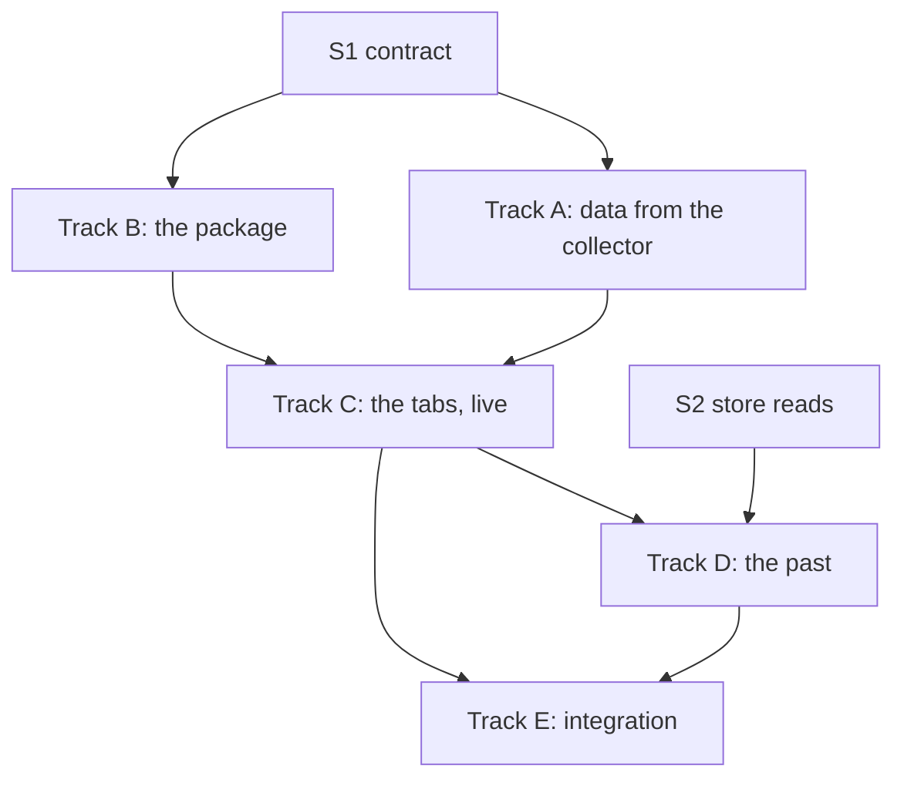

# A LiveDashboard page for timeless_beam_acct — Project Plan

A Phoenix LiveDashboard page over what a collector records: what is busy,
what ended, and what each job started. Drafted 2026-09-29 from a read of
`timeless_beam_acct`, `timeless_metrics_dashboard`, `timeless_logs_dashboard`,
`timeless_traces_dashboard`, `timeless_phoenix`, and `timeless_canvas`. No
code has been written for it.

It is a separate project, `timeless_beam_acct_dashboard`. This plan is kept
here because the first track is changes to this one.

Status legend: `[ ]` pending · `[~]` in progress · `[x]` done · `[?]` needs a decision

Size legend: **S** under a day · **M** a few days · **L** a week or more

---

## 1. Goals and non-goals

**Goals**

- Open the dashboard during an incident and see, with nothing set up, what
  the node is doing and which process is doing it.
- Follow one thing through: from a process to the exits of its group, from
  an exit to the job it was part of, from a job to its spans in the traces
  page.
- Look at a moment that has passed, from the stores, with the same pages.
- Install the way the other three Timeless pages install.

**Non-goals**

- A canvas. The layout is fixed (D1).
- Arranging a node's series beside a host's or a router's. That is what
  `timeless_canvas` is for, and the collector already feeds it.
- Collecting anything. The page reads what a collector has; it does not
  sweep or trace.
- Alerting.

---

## 2. Why the layout is fixed

| | |
|---|---|
| The data has a known shape | The questions are the same on every node, and `top`, `exits`, and `trees` already answer them in a layout that works |
| It has to work with nothing set up | A canvas that has to be arranged first is no use at the moment the page is wanted |
| The canvas is not drop-in | It needs three JavaScript hooks registered in the host's `app.js` and a route of its own. None of the three existing pages needs either |
| The canvas already does the other job | Series of a node beside series of anything else |

What is taken from the canvas is the timeline, not the layout: one time
control at the top of a fixed page (D5).

---

## 3. Findings that shape the plan

These are facts from the code, not proposals.

| # | Finding | Where | Consequence |
| --- | --- | --- | --- |
| F1 | The three existing pages are each one `PageBuilder` module with `refresher?: true`, tabs through `live_nav_bar`, a router macro, and an Igniter install task | `timeless_traces_dashboard/lib/.../page.ex:3`, `router.ex`, `mix/tasks/*.install.ex` | The fourth is built the same way, and looks the same |
| F2 | None of them registers a JavaScript hook. Charts in the metrics page are SVG made on the server and shown as an image | `timeless_metrics_dashboard/lib/.../components.ex` (`chart_embed/1`) | Sparklines and trees are drawn on the server. No change to the host's `app.js` |
| F3 | The logs and traces pages read through a `HistoricalSource` behaviour: the library in the node, or the Rust plane over HTTP, chosen in the configuration, with no falling back from one to the other | `timeless_traces_dashboard/lib/.../historical_source.ex` | The pattern for D4 exists and is followed |
| F4 | What a collector has in memory is already readable as data: `snapshot/1`, `records/1`, `spans/1`, `status/1`, `checked/1` | `lib/timeless_beam_acct.ex` | The live tabs need no store |
| F5 | `TimelessBeamAcct.Report` filters as data (`filter_events/2`) but totals and trees only as text | `lib/timeless_beam_acct/report.ex` | Totals and trees have to be had as data before a page can draw them (A1) |
| F6 | `snapshot/1` copies the whole table of processes, and `records/1` and `spans/1` the whole of what is kept | `processes.ex` (`snapshot/2`), `history.ex` (`read/1`) | Fine at a hundred processes. At a hundred thousand, every refresh of every open page copies 47 MiB. A read that is bounded is needed (A2) |
| F7 | A collector keeps the last reading of the node, and not the readings before it | `collector.ex` (`note_vm/3`) | A sparkline of the last few minutes has to come from somewhere else (D7) |
| F8 | A collector may be in another node than the dashboard, put there by `TimelessBeamAcct.Remote` | `lib/timeless_beam_acct/remote.ex` | LiveDashboard already has a node to choose. The page reads from the node chosen, which has the collector's modules if it has a collector |
| F9 | A record carries the `trace_id` and `span_id` of its span | `accounting.ex` (`put_place/2`) | An exit links to its job, and a job to the traces page |
| F10 | `timeless_phoenix` hands LiveDashboard the three pages from one function | `timeless_phoenix/lib/timeless_phoenix.ex:71` (`dashboard_pages/1`) | The fourth is added there, if a collector is running (E2) |
| F11 | The stores keep time in three units: seconds for samples, microseconds for records, nanoseconds for spans | `timeless_traces_dashboard/lib/.../page.ex:22` | One time control, converted at each source |
| F12 | The names of the metrics, the keys of a record, and the attributes of a span are written down | `README.md`, "What is recorded" | They are the contract between the two projects (S1) |

---

## 4. Decisions

- [x] **D1 — Fixed layout, no canvas.** Decided.
- [x] **D2 — A separate project**, `timeless_beam_acct_dashboard`, which
  depends on this one. Decided.
- [?] **D3 — Where the live tabs read from.** **Recommended: the
  collector's memory, in the node chosen in LiveDashboard**, by `:erpc`.
  It is what `mix timeless_beam_acct.top` already does.
- [?] **D4 — Where the past is read from.** The stores in the node, the
  planes over HTTP, or either.
  **Recommended: a behaviour as in F3, the stores in the node first, the
  planes second.** Either is what the traces page does, and it is about
  twice the work of one.
- [?] **D5 — The time control.** **Recommended: one moment, "as of", and a
  window before it.** With no moment set, the page is live and refreshes.
  With one set, every tab is of that moment and nothing refreshes. The
  windows are those of the other pages (`1h`, `24h`, `7d`, `30d`).
- [?] **D6 — What the page does where no collector is running.**
  **Recommended: say so, and say how to start one. Not start one.** A
  button that begins tracing every process of a node is not one to have
  beside a refresh button. A later version may offer it behind a
  confirmation.
- [?] **D7 — Where a sparkline of the last few minutes comes from, live.**
  The page keeps the readings it has seen while it is open, as
  LiveDashboard's own charts do; or the collector keeps a short ring of
  them. **Recommended: the page keeps them.** It costs the node nothing
  when no one is looking. The cost is that a page just opened has one
  point. With a store configured (D4), the page asks it for the minutes
  before it was opened.
- [?] **D8 — The name in the menu.** **Recommended: `BEAM`**, with the
  page under the key `beam:`.

Tracks A and B are blocked by nothing. Track C is blocked by D3 and D6,
and Track D by D4 and D5.

---

## 5. The page

Seven tabs. The time control and the node are above them, and are the
same for all.

| Tab | Shows | Live, from | Past, from |
| --- | --- | --- | --- |
| **Node** | Tiles: scheduler utilisation, run queue, memory by kind, reductions, processes started and ended, and each limit as a share. A sparkline in each | `status/1`, and what the page has seen | `beam_vm_*` |
| **Processes** | The `top` table. Sorted by work, memory, queue, or age. Filtered by application or group | the table of processes | `beam_proc_*` |
| **Groups** | One row a group, or an application: processes, memory, work, queue, started, ended, failed | `beam_group_*`, `beam_app_*` of the last tick | the same |
| **Exits** | The records. Filtered by status, group, application, failed. Totals by group or application | records in memory | records in the logs store |
| **Jobs** | Trees, those in which something failed first | spans in memory | spans in the traces store |
| **Remarks** | What the VM remarked on, by kind | records in memory | records in the logs store |
| **Collector** | What `check` prints, and what was let go: records, ticks, remarks, and how often the tracer stopped listening | `checked/1`, `status/1` | `beam_acct_*` |

### What leads to what

```text
Processes ──row──▶ Exits, of that group
Groups ────row──▶ Processes, of that group     ──failed──▶ Exits, failed, of that group
Exits ─────row──▶ Jobs, the tree that has it   (by trace_id, F9)
Jobs ──────span─▶ the record of that process
Jobs ──────id───▶ the traces page, that trace
Remarks ───row──▶ Processes, that process
```

Each is a link with the filter in its query string, so a view can be
sent to someone.

### The Processes tab

```text
as of [ now            ]  window [1h]          node [app@ohm]     ⟳ 5s
────────────────────────────────────────────────────────────────────────
 Node   Processes   Groups   Exits   Jobs   Remarks   Collector

 application [ all      ▾]   group [            ]   sort [ work ▾]

        PID  APP      WORK%   REDS/s    MEMORY  MSGQ     AGE  PROCESS
  <0.124.0>  busy      14.8     225k   588 KiB     0  >42.5s  Busy.Hoarder
  <0.125.0>  busy       0.2     3.6k  16.6 KiB     0  >42.5s  Busy.Requests
  <0.126.0>  busy       0.2     2.4k  11.5 KiB     0  >42.5s  Busy.Traffic

 78 processes · 47 with series of their own · swept 3s ago in 2ms
```

### The Jobs tab

```text
 18:05:19   4 processes over 261µs   1 failed   in busy      trace b84c7c8d…  ↗
   Busy.Request.handle/1            261µs   exited timeout
   ├─ fn in Busy.Request.handle/1    52µs
   ├─ fn in Busy.Request.handle/1    98µs
   └─ fn in Busy.Request.handle/1   113µs
```

A bar beside each span for where in the job it ran is drawn on the
server, as SVG (F2).

---

## 6. Dependency map



| Lane | Track | Repo | Blocked by | Can start |
| --- | --- | --- | --- | --- |
| 1 | A — data from the collector | `timeless_beam_acct` | S1 | **now** |
| 2 | B — the package | new `timeless_beam_acct_dashboard` | nothing | **now** |
| 3 | C — the tabs, live | the new one | A1, A2, B1, D3, D6 | after those |
| 4 | D — the past | the new one | S2, C, D4, D5 | after C |
| 5 | Spikes S1, S2, S3 | both | nothing | **now**, all three at once |

Lanes 1 and 2 are in different repositories and share only the contract.

---

## 7. Phase 0 — Spikes

- [ ] **S1 — The contract.** (S) Write down, in this repository, which
  functions and which shapes the page may depend on, and say that they
  are kept across minor versions: the snapshot, a record's keys, a span's
  attributes, the names of the metrics (F12). Add a function that
  answers with the collector's version, so the page can say when it is
  reading a collector it does not understand.
  *Done when:* it is a section of the README.
- [ ] **S2 — What the stores can be asked.** (S) For each of the three
  signals, in the node and over HTTP: the query that gets one tab's rows
  at a moment, and how long it takes at a day's worth of a busy node.
  For the Processes tab that is the last value of five metrics for every
  `proc` in a window, which is the one most likely to be slow.
  *Done when:* there is a query and a measurement for each tab, or a
  note that a tab cannot be had from a store.
- [ ] **S3 — What a refresh costs the node.** (S) At 1,000, 10,000, and
  100,000 processes, what one refresh of the Processes tab costs the node
  being watched, with `snapshot/1` as it is and with a read that is
  bounded (A2). With one page open, and with ten.
  *Done when:* there is a refresh interval that is safe to default to,
  and a number of processes past which the tab shows the top of the table
  only.

---

## 8. Track A — data from the collector (`timeless_beam_acct`)

Depends on S1. The page is written against these, and nothing else in
the collector.

- [ ] **A1 — Totals and trees as data.** (M) `Report.summary/2` and
  `Report.trees/2` make text. Beside them: `Report.totals/2`, rows of
  what `summary/2` prints; and `Report.jobs/2`, each job as its header
  and its spans nested. The text is then made from the data, so that the
  two cannot disagree. No change to what is printed.
- [ ] **A2 — A read of the processes that is bounded.** (M)
  `TimelessBeamAcct.top/1` as data: sorted, filtered, and cut to `n` in
  the node, from the table, without the whole of it being copied to
  whoever asks (F6). `snapshot/1` stays as it is, for the terminal.
- [ ] **A3 — The groups and applications of the last tick, as data.** (S)
  The collector has them at each sweep and hands them to the sink. Keep
  the last in the status table, as the node's figures are kept, so the
  Groups tab is not a query of a store when it is live.
- [ ] **A4 — Records and spans by range.** (S) `records/1` and `spans/1`
  read everything kept and then choose. Read by the time asked for, from
  the table, which is in the order of arrival.
- [ ] **A5 — (Later) word of each record as it is made.** (M) For a live
  tail of exits, as the logs and traces pages have. A process asks to be
  sent each record, and is forgotten when it ends. Only if the refresh
  proves not to be enough.

A1, A2, A3, and A4 do not depend on each other.

---

## 9. Track B — the package (`timeless_beam_acct_dashboard`)

Depends on nothing.

- [ ] **B1 — The project.** (S) `mix new`, depending on
  `timeless_beam_acct`, `phoenix_live_dashboard ~> 0.8`, and
  `phoenix_live_view ~> 1.0`. A `Page` with the seven tabs, each empty,
  and the menu link (D8).
- [ ] **B2 — The router macro.** (S) `timeless_beam_acct_dashboard "/dashboard"`,
  as `timeless_traces_dashboard/2` (F1).
- [ ] **B3 — The install task.** (S) With Igniter, optional, as the
  others. It adds the page to the router and says how to start a
  collector. It does not add one to the supervision tree without being
  asked (D6).
- [ ] **B4 — The source.** (S) A behaviour, `Source`, with one function
  for each tab's rows. `Source.Live` reads the collector in the node
  chosen (D3). The tabs are written against the behaviour, so that Track
  D adds a source and changes no tab.
- [ ] **B5 — A source for tests.** (S) `Source.Fixed`, which answers from
  data written by hand, so the tabs are tested with no collector and no
  node.

B1 first. B2, B3, B4, and B5 then do not depend on each other.

---

## 10. Track C — the tabs, live

Depends on A1, A2, B1, B4, and on D3 and D6.

- [ ] **C1 — Collector.** (S) First, because it is what the page shows
  when there is nothing else to show: no collector, a collector of a
  version it does not understand, a collector that has stopped listening.
- [ ] **C2 — Processes.** (M) The table of A2, its sort, its filters, and
  the line under it.
- [ ] **C3 — Exits.** (M) The table, its filters, and the totals of A1.
  The filters are those of `Report.filter_events/2`, and are in the query
  string.
- [ ] **C4 — Jobs.** (M) The trees of A1, with the bar beside each span.
  A job that is long is cut short and says so, as `trees` does.
- [ ] **C5 — Groups.** (S) From A3.
- [ ] **C6 — Remarks.** (S) The Exits table with another kind.
- [ ] **C7 — Node.** (M) The tiles, and a sparkline in each from what the
  page has seen (D7).
- [ ] **C8 — What leads to what.** (S) The links of section 5, once the
  tabs they join are there.
- [ ] **C9 — Tests.** (M) Each tab against `Source.Fixed`, compared with
  what is expected as `Report` is tested: whole, so that a change in
  layout is a failing test. One test of the whole page against a
  collector the test starts.

C2, C3, C4, and C7 do not depend on each other, and all edit `Page`.
Give each tab a module of its own from the start, so that they do not
meet there.

---

## 11. Track D — the past

Depends on S2 and Track C, and on D4 and D5.

- [ ] **D1 — The time control.** (M) "As of" and the window (D5), in the
  query string. With a moment set, the refresher is off and the page says
  which moment it is of.
- [ ] **D2 — The stores in the node.** (L) `Source.Stores`: each tab's
  rows from `TimelessMetrics`, `TimelessLogs`, and `TimelessTraces`, by
  the queries of S2. The units of F11 are converted here and nowhere
  else.
- [ ] **D3 — The planes.** (L) `Source.Planes`: the same over HTTP. If D4
  is decided as the stores in the node only, this is not built.
- [ ] **D4 — Sparklines from before the page was opened.** (S) Where
  there is a store, the Node tab asks it for the window, and adds what it
  sees to the end of that.
- [ ] **D5 — Where a tab cannot be had.** (S) A tab that a store cannot
  answer for (S2) says so, and says which moment it could be had of. It
  is not left empty.

D2 and D3 do not depend on each other.

---

## 12. Track E — integration

Depends on Track C. E4 depends on Track D.

- [ ] **E1 — The README**, with each tab as it looks, and the two ways a
  collector is started.
- [ ] **E2 — `timeless_phoenix`.** (S) `dashboard_pages/1` has the fourth
  page (F10), when `timeless_beam_acct_dashboard` is among the
  dependencies.
- [ ] **E3 — Against a node that is busy.** (M) `examples/busy_node.exs`,
  with a collector, and the page open for an hour. What the page costs
  the node is measured and written down, as the collector's cost is.
- [ ] **E4 — Against a moment that has passed.** (S) The same node, the
  next day, from the stores.

---

## 13. Milestones

| Milestone | Contains | Proves |
| --- | --- | --- |
| **M0 — Agreed** | D3–D8, S1–S3 | The page can be built against a contract, and a refresh is known to be safe |
| **M1 — What is happening** | Track A, Track B, C1–C4 | The three views of the terminal, in the dashboard, live |
| **M2 — All of it, live** | C5–C9, E1, E2 | Every tab, each leading to the next |
| **M3 — What happened** | Track D, E3, E4 | The same pages, of last Tuesday |

M1 is useful on its own, and needs no store.

---

## 14. Risks

| Risk | Impact | Mitigation |
| --- | --- | --- |
| A refresh copies the table of processes | The page slows the node it is there to watch, most on the nodes that most need watching | S3 before C2. A2. A refresh interval that lengthens with the number of processes, as the sweep's does |
| The Processes tab cannot be had from a store quickly | The past has six tabs and not seven | S2 before D2. D5. The top groups, which are a few hundred series, in its place |
| The page and the collector are of different versions | A tab is empty, or raises | S1. C1 shows the version and what it means |
| The node chosen has no collector's modules | `:erpc` raises `undef` | C1: it is what "no collector" looks like from another node, and is said as that |
| Two sources of the past that do not agree | A tab differs by where it was read from | One behaviour (B4), and the conversions in one place (D2) |
| Trees of jobs with thousands of spans | A page too large to send | C4 cuts a tree short. `:max_lines`, as `trees` has |
| Tabs built at once in one module | They meet in `Page` | A module a tab, from B1 |

---

## 15. Things that need you

- D3 to D8. D4 decides the size of Track D more than anything else does.
- The repository for `timeless_beam_acct_dashboard`, and its name.
- E3 and E4 are against a node and stores you choose. Nothing is pointed
  at the planes that are running without being asked.

---

## 16. Suggested first moves

All four can start today, with no decision outstanding:

1. **A1** — totals and trees as data. It changes nothing that is printed,
   and every tab but two is drawn from it or from A2.
2. **A2** — the read that is bounded, with **S3** to say by how much.
3. **B1** and **B5** — the project, and the source the tabs are tested
   against.
4. **S2** — what the stores can be asked, which is what is least known.
