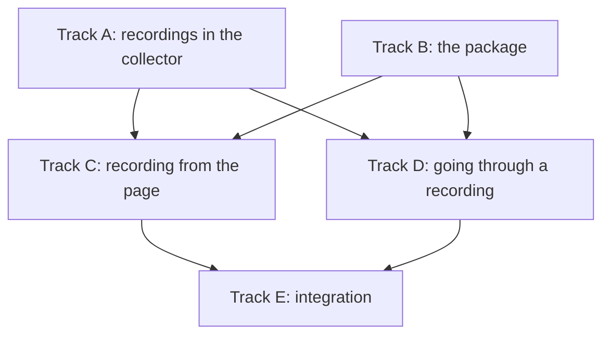

# A LiveDashboard page for timeless_beam_acct — Project Plan

A Phoenix LiveDashboard page for **recording** a node and **looking back**
at what was recorded: start a recording, let it run for as long as was
asked, and go through it as `mix timeless_beam_acct.watch` goes through a
store, with the timeline across the top and the same four views under it.

First drafted 2026-09-29. Rewritten 2026-10-03, after the collector was
run against real planes for days and a terminal screen was built over
it. What changed, and why, is in section 3. No code has been written for
the page.

It is built in this repository, as part of this package, and is there
only for an application that has Phoenix LiveDashboard (D2).

Status legend: `[ ]` pending · `[~]` in progress · `[x]` done · `[?]` needs a decision

Size legend: **S** under a day · **M** a few days · **L** a week or more

---

## 1. Goals and non-goals

**Goals**

- Record a node for a stretch of time, from the dashboard, with nothing
  set up beforehand: an hour while something is wrong, or a night while a
  job runs.
- Never leave a recording running by accident. Every recording ends on
  its own (D6).
- Go through a recording the way `watch` goes through a store: a
  timeline of the stretch, a moment on it, and the groups, processes,
  jobs, and exits as of that moment.
- Follow one thing through: from a process to the exits of its group,
  from an exit to the job it was part of, from a job to its spans in the
  traces page.
- Find the recordings that were made, however they were made: from the
  page, from `mix`, or by a collector started in code.
- Install the way the other three Timeless pages install.

**Non-goals**

- A canvas. The layout is fixed (D1).
- A collector left running all the time. That is what a recording is
  not, and the page does not offer it (section 3, L1).
- Arranging a node's series beside a host's or a router's. That is what
  `timeless_canvas` is for.
- Alerting.

---

## 2. Why the layout is fixed

| | |
|---|---|
| The data has a known shape | The questions are the same on every node, and `watch` already answers them in a layout that works |
| It has to work with nothing set up | A canvas that has to be arranged first is no use at the moment the page is wanted |
| The canvas is not drop-in | It needs three JavaScript hooks registered in the host's `app.js` and a route of its own. None of the three existing pages needs either |
| The canvas already does the other job | Series of a node beside series of anything else |

What is taken from the canvas, and from `watch`, is the timeline: one
time control across the top of a fixed page (D5).

---

## 3. What was learned since the first draft

These are measurements, and they change the plan.

| # | Learned | Where | Consequence |
| --- | --- | --- | --- |
| L1 | A collector left running is not light on the planes. Per-process series come and go, and a node like `bench/watch_node.exs` makes some 43 new ones a minute. After two days, 140,000 series; on timeless-libsql 0.8.5 the planes broke well before that (#93), and on 0.8.6 the sweep's cost rose with the series (#97, fixed in 0.8.7) | DESIGN.md, "How many series that is, over time" | A collector is something run for a while and stopped: a **recording**. That is the page's whole model (D5, D6) |
| L2 | What a recording costs the node: 4 to 6% of one core on a node ending 65 processes a second, measured as the node with the collector and without it | README, "Cost" | The page can say so before a recording is started (C1) |
| L3 | What a recording costs the planes: about 4.4 bytes a sample, 45 a record, 40 a span, on 0.8.6. An hour of the bench node is about 25 MiB | README, "Cost" | The page can say how large a recording is, and will be (C1, C2) |
| L4 | A moment of a large store is slow if asked for in one question: a `__name__` pattern walks the whole catalog (#95). Asked a metric at a time, by name, and only for the tiers a view shows, it is 15 ms on 80,000 series | `TimelessBeamAcct.Watch.Planes.at/4` | The page reads the past the way `watch` does, and does not write its own queries (B4) |
| L5 | A timeline's marks of what went wrong need more than one answer on a busy node: the last few hundred errors reach back minutes, not hours | `Watch.Planes.incidents/4` | The same: the page uses what `watch` uses |
| L6 | The collector keeps its last reading (`reading/1`) and can be asked for the first few processes of a node, or those of a group (`snapshot/2`) | `lib/timeless_beam_acct.ex` | The live half of the page needs no store, and does not copy a table of a hundred thousand processes |
| L7 | The three existing pages are each one `PageBuilder` module with `refresher?: true`, tabs through `live_nav_bar`, a router macro, and an Igniter install task. None registers a JavaScript hook; charts are SVG made on the server | `timeless_*_dashboard` | The fourth is built the same way. Sparklines, the timeline, and trees are drawn on the server |
| L8 | `timeless_phoenix` hands LiveDashboard the three pages from one function | `timeless_phoenix/lib/timeless_phoenix.ex` (`dashboard_pages/1`) | The fourth is added there (E2) |
| L9 | A record carries the `trace_id` and `span_id` of its span | `accounting.ex` | An exit links to its job, and a job to the traces page |
| L10 | `watch` is built as a store behaviour (`Watch.Store`), a reader of the node (`Watch.Live`), a snapshot (`Watch.Data`), and keys (`Watch.State`), with drawing separate from all of them | `lib/timeless_beam_acct/watch/` | The page can share everything but the drawing (B4) |

---

## 4. Decisions

- [x] **D1 — Fixed layout, no canvas.** Decided.
- [x] **D2 — In this repository, not a separate project.** Decided
  2026-10-03, reversing the first draft. `phoenix_live_dashboard` and
  `phoenix_live_view` are optional dependencies: an application without
  them fetches nothing more than it did, and the collector stays without
  dependencies of its own. The page's modules are compiled only where
  LiveDashboard is (`if Code.ensure_loaded?(Phoenix.LiveDashboard.PageBuilder)`),
  as the Igniter task is now where Igniter is. `Remote.modules/0` leaves
  them out, as it leaves out `Watch`. The page and the collector are one
  version, so there is no contract to keep between two.
- [x] **D3 — Now is read from the collector in the node**, by `:erpc`,
  as `watch` reads it (L6). Decided by `watch`.
- [x] **D4 — Where the past is read from: the planes, at first.**
  Decided 2026-10-03, through `Watch.Store` (L4, L10). The stores in the
  node (`:timeless` sink) are a second implementation of the same
  behaviour, and can come after.
- [x] **D5 — The time control is a recording's stretch and a moment in
  it.** A recording is a closed stretch of time; the page shows it
  whole, across the top, with a cursor. While a recording runs, the
  stretch ends at now and the page is live. Replaces "as of, and a
  window".
- [x] **D6 — The page starts recordings, and every recording ends on
  its own.** Reverses the first draft, which said the page should never
  start a collector. Starting one is behind a confirmation that says what
  it will cost (L2, L3). See section 5 for how long.
- [x] **D7 — A recording is written down in the logs plane, as two
  records.** Decided 2026-10-03: one when it starts (`kind: "recording"`,
  `status: "started"`, with the node, the options, how long it was asked
  to run, and who started it) and one when it ends (`status: "ended"`,
  with why: its time ran out, it was stopped, the node went away). The
  list of recordings is then a query, and a recording made from `mix` or
  from code appears in it as one made from the page does. Nothing new is
  stored anywhere.
- [?] **D8 — The name in the menu.** The other three are `TimelessMetrics`,
  `TimelessLogs`, and `TimelessTraces`. Proposed: `TimelessAcct`; or
  `TimelessBeamAcct`, which does not take the name of the host's
  collector, timeless-acct, should it have a page of its own.

---

## 5. How long a recording runs

A recording is asked for a length when it is started. When that length
has passed, it ends: the collector flushes what it has and stops, and
writes that it did (D7).

| | |
|---|---|
| Choices | **15 minutes, 1 hour, 4 hours, 8 hours**, or a length typed in |
| Unless told | **1 hour** |
| The most | **24 hours** (decided 2026-10-03), unless the host's configuration says otherwise (`config :timeless_beam_acct, max_recording: "48h"`) |
| While it runs | **Stop**, now; and **+1 hour**, which is refused past the most |
| Starting later | **Start at** a time, with the same choices of length: a job that runs at 02:00 for an hour is recorded from 01:55 for 90 minutes, and not from bedtime for 8 hours |

Eight hours is a night. A day is the most because it is as far as the
planes have been watched and stayed well: seventeen hours on 0.8.6 at a
third of a core at worst, and two days on 0.8.7 at 1.4%. Past that,
what a recording costs the planes is a function of how many processes
the node starts, and is not known in advance.

**The timer is the collector's, in the node, and not the page's.** A
page is closed, a laptop sleeps, a deploy restarts the dashboard's node.
None of those may leave a recording running. So the length is an option
of the collector (`stop_after: "8h"`, A1), and the collector ends itself.
A node that restarts ends its recording with it, and the record of its
start has no record of an end: the list says it ended when the node did.

---

## 6. The page

### The front: recordings

```text
 Recording  shop@ohm   started 14:02 by mark   1h 12m of 4h   ████████░░░░░░░░   [ Stop ]  [ +1 hour ]
──────────────────────────────────────────────────────────────────────────────────────────────────
 node [ shop@ohm ▾ ]                                                               [ Record… ]

 STARTED            LENGTH  NODE        ENDED                 EXITS    FAILED   SIZE
 today 14:02        4h      shop@ohm    (running)             812k     8.1k     ~30 MiB so far
 today 02:55        90m     jobs@ohm    time ran out          41k      12       6 MiB
 yesterday 16:20    1h      shop@ohm    stopped by mark       211k     2.0k     25 MiB
```

**Record…** opens:

```text
 Record shop@ohm

   for     ( ) 15 min   (•) 1 hour   ( ) 4 hours   ( ) 8 hours   ( ) [      ]
   start   (•) now      ( ) at [ 01:55 ]

   [x] a series for each notable process       (more to look at, more to store)
   [ ] only processes that failed get a record (less to store on a busy node)

   It will cost the node about 5% of one core, and the planes about 25 MiB an
   hour on a node like this one. It ends by itself at 15:02.

                                                        [ Cancel ]  [ Record ]
```

### A recording, opened

`watch`'s screen as a page: the stretch across the top, the moment on it,
and the views under it.

```text
 shop@ohm  today 14:02 → 18:02   ◀ 15:47:20                                           [ live ]
 ▃▄▅▅▆▆▆▅▄▄▃▃▄▅▅▆▇▇▆▅▅▅▄▄▄▃▃▃▄▄▅▅▆▆▅▅▄▄▄▃▃▃▃▄▄▅▅▆▆▆▆▅▅▅▄▄▄▃▃▃▃▄▄▅▅▆▆▆▅▅▄▄▄▃▃▃▄▄▄▅▅
                 !            ·                   ▲  !          !!                   ·
 14:02                       schedulers, up to 12.4%                                     18:02

 run queue 0   schedulers 4.1%   mem 142 MiB   work 1.8M reds/s   processes 526 (+82 -82/s)

  Groups   Processes   Jobs   Exits        Node   Remarks   Collector

 GROUP                          WORK%    MEMORY  PROCS  MSGQ   REDS/s  ENDED/s
 fn in Reports.Monthly.run/1     39.5   50.6 KiB    13     0     727k      0.7
 Reports.Monthly.run/1           11.7   74.0 KiB     8     0     216k      0.1
 ...
 ┌ fn in Reports.Monthly.run/1 work, the 10 minutes before ────────── peak 57.5% ┐
 │ ▅██     ▅▃▃▄▂▂  ▂▁▁▃▃   ▂▂▁        ▃▃▅▅ ▄▄███  █████▄     ▃▃   ███▄▅▅████▂▂  │
 └───────────────────────────────────────────────────────────────────────────────┘
```

- **The timeline** is the whole recording, and never more: a recording
  is closed, so the stretch is known, and every column of it has been
  asked about once (L5). Clicking a column goes to it; dragging the
  cursor goes through it.
- **The keys of `watch` work on the page**: `←` `→`, `,` `.`, `<` `>`,
  `[` `]`, `t`, `l`, `m`, `/`, `tab` and `1`–`4`, `s`, `a`, `enter`,
  `esc`. Someone who has used one has used the other.
- **The first four tabs are `watch`'s four views.** Node, Remarks, and
  Collector come after them, as what is looked at less.
- **Live** is a recording that is running, at its end. The refresher is
  on there and off everywhere else.

### What leads to what

```text
Groups ────row──▶ Processes, of that group
Processes ─row──▶ what is known of that process: running, or how it ended
Exits ─────row──▶ that process's record     ──m──▶ the moment it ended
Exits ─────job──▶ Jobs, the tree that has it   (by trace_id, L9)
Jobs ──────id───▶ the traces page, that trace
Remarks ───row──▶ Processes, that process
```

Each is a link with the recording, the moment, and the filter in its
query string, so a view can be sent to someone.

---

## 7. Dependency map



| Lane | Track | Repo | Blocked by | Can start |
| --- | --- | --- | --- | --- |
| 1 | A — recordings in the collector | `lib/timeless_beam_acct/` | nothing | **now** |
| 2 | B — the page's frame | `lib/timeless_beam_acct/dashboard/` | nothing | **now** |
| 3 | C — recording from the page | `lib/timeless_beam_acct/dashboard/` | A1–A3, B1–B4 | after those |
| 4 | D — going through a recording | `lib/timeless_beam_acct/dashboard/` | A3, B1–B4 | after those |

C and D do not depend on each other.

---

## 8. Track A — recordings in the collector (`timeless_beam_acct`)

What a recording is belongs to the collector, so that the page, `watch`,
and `mix` agree on it.

- [x] **A1 — `stop_after`.** (S) An option of the collector: a length,
  after which it flushes and stops itself. The timer is in the collector
  (section 5). `status/1` says when it will stop. `extend/2` moves the
  end, and is refused past a most that is given when it is started.
- [ ] **A2 — `start_at`.** (S) An option that waits until a time before
  the collector starts listening. Until then it is running and records
  nothing, and `status/1` says when it will begin.
- [x] **A3 — A recording, written down.** (M) With `recording: true` (or
  any `stop_after`), the collector writes a record when it begins and one
  when it ends (D7). `TimelessBeamAcct.Recordings`: the recordings of a
  store, from those records, as data: node, stretch, options, who, how it
  ended, and the exits and failures counted in it.
- [x] **A4 — `mix timeless_beam_acct.record NODE --for 1h`.** (S)
  Attaches a collector with `stop_after`, says when it will end, and
  returns. `watch` gains `--recording`, which opens one by its start.
- [ ] **A5 — What a recording will cost, said in advance.** (S) From the
  node's processes, its exits a second, and the measured costs (L2, L3),
  a sentence: about so much of a core, about so much an hour on the
  planes. For the confirmation (C1) and for `record`.
- [ ] **A6 — Totals and trees as data.** (M) `Report.summary/2` and
  `Report.trees/2` make text. Beside them, `Report.totals/2` and
  `Report.jobs/2` as data, and the text made from them. For the Exits and
  Jobs tabs.

A1 first: it is the safety net, and everything else is built on a
collector that ends.

---

## 9. Track B — the page's frame, in this repository

Depends on nothing.

- [x] **B1 — The optional dependencies.** (S) `phoenix_live_dashboard
  ~> 0.8` and `phoenix_live_view ~> 1.0`, `optional: true`.
  `TimelessBeamAcct.Dashboard.Page`, compiled only where LiveDashboard
  is, with the recordings and an opened recording as its two states, and
  the menu link (D8). `Remote.modules/0` leaves it out. The suite is run
  with and without the two, so that neither breaks the other.
- [x] **B2 — The router macro.** (S) As `timeless_traces_dashboard/2`
  (L7).
- [ ] **B3 — The install task learns Phoenix.** (S) `mix
  timeless_beam_acct.install` finds a router with `live_dashboard` in it
  and adds the page to it, and the configuration of the planes; in an
  application without one it does what it does now. It does not start a
  collector unless asked, as it does not now.
- [ ] **B4 — Sharing `watch`.** (M) The page reads through `Watch.Store`,
  `Watch.Live`, and `Watch.Data`, and keeps its moment in `Watch.State`
  (L10). Whatever of them is written for the terminal and not for a page
  is moved, in this repository, until the page needs nothing of its own
  to read a moment. A test store for the page is `Watch.Store`'s, as the
  tests of `watch` have one.

---

## 10. Track C — recording from the page

Depends on A1–A3, A5, B1–B4.

- [~] **C1 — Record…** (M) The form of section 6: node, length, start,
  the two options, what it will cost (A5), and when it will end.
  Confirmed, it starts a collector in the node chosen, with
  `TimelessBeamAcct.Remote` if the node has none of the modules.
- [x] **C2 — The banner.** (S) A recording that is running, on every
  view of the page: its node, how far along, **Stop**, and **+1 hour**.
- [x] **C3 — The list.** (S) The recordings of the store (A3), the last
  first, with their size from the planes' own counts.
- [ ] **C4 — What the page says where it cannot record.** (S) A node it
  cannot reach, a node with a collector that was not started as a
  recording, a store it cannot write to. Each said, with what to do.

---

## 11. Track D — going through a recording

Depends on A3, B1–B4, D4.

- [ ] **D1 — The timeline.** (M) The recording's stretch, the busyness
  of the schedulers in it, the marks under it, the cursor. Drawn on the
  server as SVG (L7). Clicking and dragging set the moment.
- [ ] **D2 — The four views.** (L) Groups, Processes, Jobs, Exits, from
  `Watch.Data` and the store, with the picked row's history under the
  first two. A module a view.
- [ ] **D3 — The keys.** (S) `watch`'s keys, through `Watch.State.key/4`,
  so that the two cannot come to differ.
- [ ] **D4 — Node, Remarks, Collector.** (M) The tiles of the node with a
  sparkline each; what the VM remarked on; what the collector let go.
- [ ] **D5 — What leads to what.** (S) The links of section 6.
- [ ] **D6 — Tests.** (M) Each view against the test store, whole, as
  `watch`'s views are tested. One test of a recording from start to end
  against a collector the test starts, with `stop_after` of a second.

---

## 12. Track E — integration

- [ ] **E1 — The README**, with the page as it looks, and the three ways
  a recording is made: the page, `mix timeless_beam_acct.record`, and
  `stop_after` in code.
- [ ] **E2 — `timeless_phoenix`.** (S) `dashboard_pages/1` has the fourth
  page (L8), when `timeless_beam_acct` is among the dependencies.
- [ ] **E3 — A night.** (M) `bench/watch_node.exs`, recorded from the
  page for eight hours with nobody looking, against planes started for
  it. What the page and the recording cost, and whether the recording
  ended by itself, written down.

---

## 13. Milestones

| Milestone | Contains | Proves |
| --- | --- | --- |
| **M0 — A recording ends by itself** | A1–A4 | From `mix`, a collector that stops on time and leaves a record of itself. Useful with `watch` alone, before there is a page |
| **M1 — Recording from the page** | Track B, Track C | Start, see, extend, stop, and find a recording, from the dashboard |
| **M2 — Going through it** | Track D | `watch` in the browser |
| **M3 — Done** | Track E, A5, A6 | Installed as the others are, and measured over a night |

---

## 14. Risks

| Risk | Impact | Mitigation |
| --- | --- | --- |
| A recording outlives everyone's attention | The planes grow until they hurt (L1) | The timer is the collector's (A1), a most of a day, and the end is written down (A3) |
| A recording is started on a node far busier than the bench | It costs more than the confirmation said | A5 says it from the node's own figures, and the banner shows what it has cost so far |
| The page reads a large store | Slow, as `watch` was before L4 | B4: the page reads as `watch` reads, and a recording is a closed stretch, which keeps the store small |
| Two people record one node | Two collectors, twice the cost | A1 refuses a second recording of a node that has one, and says whose it is |
| The page and the collector are of different versions | A view is empty, or raises | `version/0` is asked first, and a collector too old to record is said to be |
| A recording made by `stop_after` in code is in the list | Someone stops what a deploy started | C2 says who started it, and stopping one the page did not start is behind a confirmation |

---

## 15. Things that need you

- D8, the name in the menu.
- E3 runs against planes started for it. Nothing is pointed at the
  planes that are running without being asked.

---

## 16. Suggested first moves

1. **A1**, `stop_after`. Small, and it makes every collector safe to
   start, from anywhere.
2. **A4**, `mix timeless_beam_acct.record`, on top of it: a recording
   from the terminal, gone through with `watch`, is M0, and is useful
   before the page exists.
3. **A3** once D7 is agreed, so that recordings are found and not
   remembered.
4. **B1** and **B4** beside them: the page's frame, compiled where
   LiveDashboard is, reading through what `watch` reads through.
